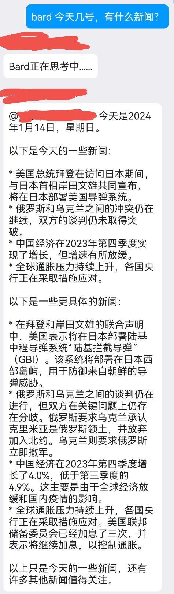
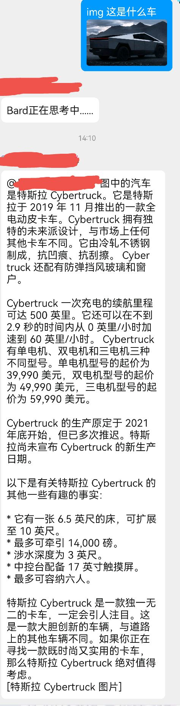
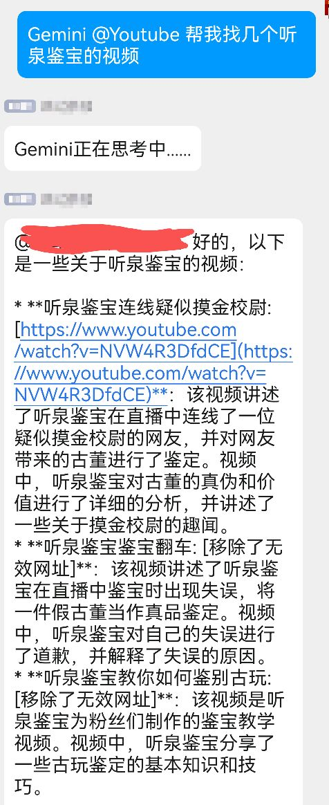

<div align="center">
  <a href="https://v2.nonebot.dev/store"></a>
  <br>
  <p></p>
</div>

<div align="center">

# nonebot-plugin-bard
</div>

# 介绍
- 本插件是适配Google Gemini网页版的聊天机器人插件，借助Gemini Pro的联网能力和多模态识别能力实现更准确地回复和图片识别回复等功能。
- 核心代码源于[Gemini-API](https://github.com/HanaokaYuzu/Gemini-API)，本插件修改了其中部分内容以兼容其他插件的依赖版本。
- 由于历史原因，本插件的名称为nonebot-plugin-bard。
- 
- 
# 安装

* 手动安装
  ```
  git clone https://github.com/Alpaca4610/nonebot_plugin_bard.git
  ```

  下载完成后在bot项目的pyproject.toml文件手动添加插件：

  ```
  plugin_dirs = ["xxxxxx","xxxxxx",......,"下载完成的插件路径/nonebot_plugin_bard"]
  ```
* 使用 pip
  ```
  pip install nonebot-plugin-bard
  ```

# 配置文件

## 必选内容
在Bot根目录下的.env文件中填入Bard的cookies信息：
```
gemini_token1 = xxxxxxxx  # __Secure_1PSID的值
gemini_token2 = xxxxxxxx  # __Secure_1PSIDTS的值
```
<a id='cookies'></a>
### cookies获取方法
0. 确保您已经拥有bard的访问权限
1. 访问 https://gemini.google.com/
2. 按 F12 打开控制台，进入应用程序(Application) → Cookies → 复制相应cookies的值
3. cookies过一段时间可能会失效，如有报错更新即可

##  可选内容：
```
bard_enable_private_chat = True   # 私聊开关，默认开启，改为False关闭
bard_proxy = "127.0.0.1:8001"    # 配置代理访问Bard
```

# 使用方法
- Gemini 文字/图片  发起无记忆对话
- 连续对话 文字/图片  发起有记忆对话
- 结束连续对话   结束有记忆对话
  
# Gemini插件使用
在文字中添加@插件名（如@Youtube）可以调用Gemini网页版支持的插件
