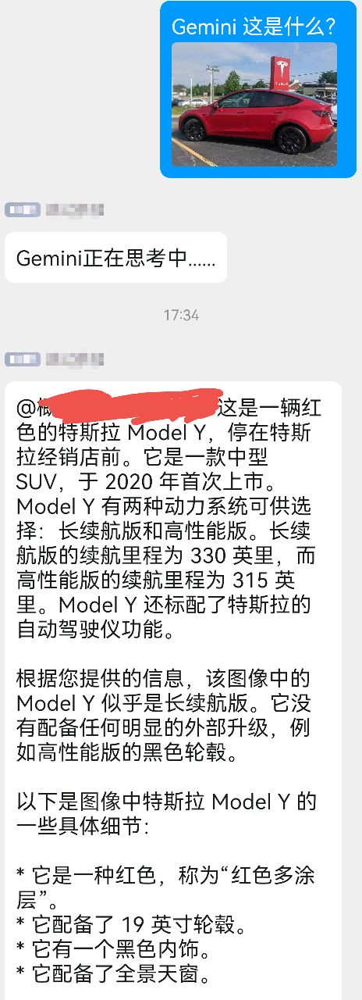
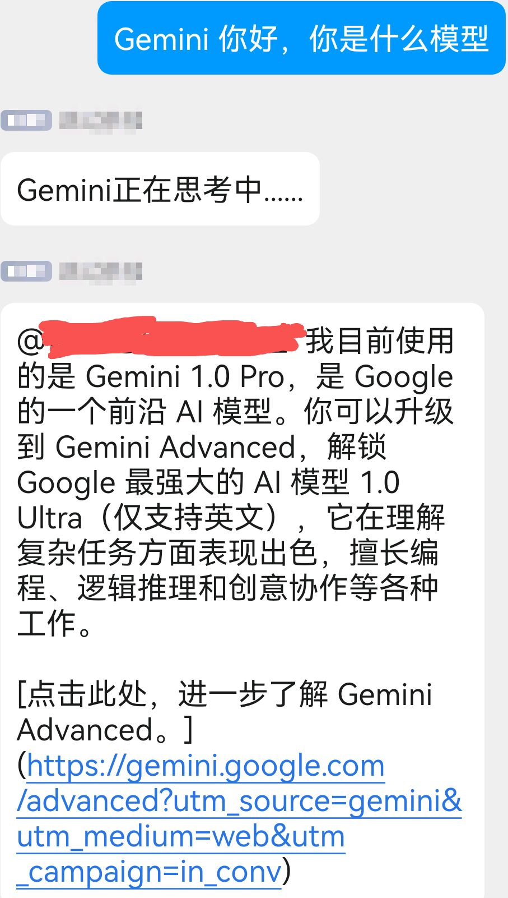

<div align="center">
  <a href="https://v2.nonebot.dev/store"></a>
  <br>
  <p></p>
</div>

<div align="center">

# nonebot-plugin-bard
</div>

# 介绍
- 本插件是适配Google Bard模型的聊天机器人插件，借助bard的联网能力和多模态识别能力实现更准确地回复和图片识别回复等功能。
- 目前中文回答和英文回答使用的模型均为Gemini Pro
- 
- 
# 安装

* 手动安装
  ```
  git clone https://github.com/Alpaca4610/nonebot_plugin_bard.git
  ```

  下载完成后在bot项目的pyproject.toml文件手动添加插件：

  ```
  plugin_dirs = ["xxxxxx","xxxxxx",......,"下载完成的插件路径/nonebot_plugin_bard"]
  ```
* 使用 pip
  ```
  pip install nonebot-plugin-bard
  ```

# 配置文件

## 必选内容
在Bot根目录下的.env文件中填入Bard的cookies信息：
```
bard_token = xxxxxxxx
```
<a id='cookies'></a>
### cookies获取方法
0. 确保您已经拥有bard的访问权限
1. 访问 https://bard.google.com/
2. 按 F12 打开控制台，进入应用程序(Application) → Cookies → 复制 ```__Secure-1PSID``` 的值，注意不要包含```__Secure-1PSID```本身
3. cookies过一段时间可能会失效，如有报错更新即可

##  可选内容：
```
bard_enable_private_chat = True   # 私聊开关，默认开启，改为False关闭
bard_proxy = "127.0.0.1:8001"    # 配置代理访问Bard
```
若配置了bard_token还无法访问bard，请额外增加两项cookies信息，bard_token也需要配置）
```
bard_token1 = "xxxxxxxx"  # "__Secure-1PSIDTS"的值
bard_token2 = "xxxxxxxx"  # "__Secure-1PSIDCC"的值
```

# 使用方法
- bard+文字 发起无记忆对话
- bard+图片 调用bard的多模态识别能力识图
